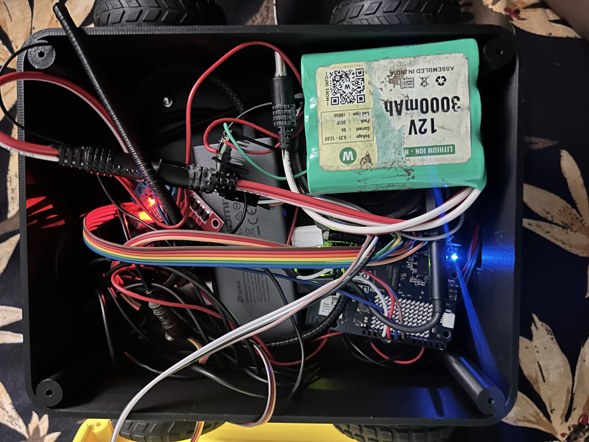

# Build Aura from the supplied files

This is the step-by-step recreation guide for Aura, a voice-first Arduino UNO Q companion robot. Read the [root README](README.md) first for the project story, photographs, architecture, complete bill of materials, and safety boundaries.

## What you are building

Aura is a two-wheel expressive robot. An Arduino UNO Q runs two cooperating programs: the MCU sketch makes the OLED face, servo head, and L298N motors responsive in real time, while the Linux side runs Gemini Live voice conversation. A USB microphone hears the user and a powered AUX speaker plays Aura's reply. Arduino App Lab bridges the two sides and provides a manual dashboard.




## Before you start

- Print or open the [circuit diagram](circuit_image.png) beside your workbench.
- Gather every part in the [complete BOM](README.md#complete-bill-of-materials).
- Keep the motor and servo supply disconnected until all signal wiring is checked.
- Do the first motor test with the wheels off the floor.
- Aura has no obstacle, bumper, or cliff sensors. Never leave it moving unattended.

## 1. Print and assemble the enclosure

Print the files in [`3D Assets`](<3D Assets>) in this order:

1. [`01_lower_chassis_8_round_holes.stl`](<3D Assets/01_lower_chassis_8_round_holes.stl>) — lower chassis.
2. [`02_body_cover_centred_servo.stl`](<3D Assets/02_body_cover_centred_servo.stl>) — body cover and servo mount.
3. [`03_oled_head_front_M3.stl`](<3D Assets/03_oled_head_front_M3.stl>) — OLED face front with M3 mounting points.
4. [`04_head_rear_cover.stl`](<3D Assets/04_head_rear_cover.stl>) — head back cover.
5. [`05_two_arm_horn_adapter.stl`](<3D Assets/05_two_arm_horn_adapter.stl>) — link between head and two-arm servo horn.

No slicer profile is included. Use settings appropriate for your material and printer, and fit-test holes before forcing screws through them.

Mount the motors and wheels in the lower chassis. Fit the servo into the centered body mount, but **do not** attach the printed horn adapter yet. Install the OLED in the front head part, route its four wires safely through the neck, and close the head with the rear cover. Leave enough slack for the head to turn without pulling on the OLED wires. Reserve space for the battery low in the chassis, secure it so it cannot reach a wheel or shift into exposed wiring, and keep its leads away from sharp printed edges.

After the electronics are powered and the dashboard works, call `/api/servo/90` to center the servo. Only then attach the two-arm horn adapter and the head. This is important: attaching it before centering can make Aura's 55°–135° head range hit the mechanical stops.

## 2. Wire the UNO Q, L298N, servo, and OLED


All connections below are derived from the pin constants in [`Arduino Uno Q App/sketch/sketch.ino`](<Arduino Uno Q App/sketch/sketch.ino>). Make every connection with power disconnected.

### UNO Q digital-pin table

| UNO Q pin | Wire to | Purpose |
| --- | --- | --- |
| D6 | Servo signal | Moves the head; firmware limits commands to 55°–135°. |
| D7 | L298N IN1 | Left motor direction. |
| D8 | L298N IN2 | Left motor direction. |
| D9 (PWM) | L298N ENA | Left motor speed. |
| D10 (PWM) | L298N ENB | Right motor speed. |
| D12 | L298N IN3 | Right motor direction. |
| D13 | L298N IN4 | Right motor direction. |
| SDA | OLED SDA | I²C data. Use the UNO Q pin physically marked SDA/I²C. |
| SCL | OLED SCL | I²C clock. Use the UNO Q pin physically marked SCL/I²C. |
| GND | L298N GND, servo GND, OLED GND, supply negative | Mandatory shared electrical reference. |

### L298N and motor side

1. If your L298N module has ENA and ENB jumpers, remove them. D9 and D10 need direct access to ENA/ENB for PWM speed control.
2. Connect `OUT1` and `OUT2` to the left motor; connect `OUT3` and `OUT4` to the right motor.
3. Connect the dedicated motor supply to the L298N motor-power input and its negative terminal to L298N GND.
4. Connect L298N GND to UNO Q GND. Without this common ground, the direction and speed signals have no reliable reference.
5. Follow the voltage-regulator jumper instructions printed on your exact L298N module. Do not use its 5 V pin to back-power the UNO Q.

If left or right travel is backward during a safe test, set `LEFT_REVERSED` or `RIGHT_REVERSED` to `true` in the sketch for that side. This preserves the meaning of spoken directions.

### Servo and OLED side

1. Connect the servo signal lead to D6, its ground to the common ground, and its positive lead to a regulated supply suitable for the specific servo.
2. Connect OLED SDA and SCL to the dedicated UNO Q I²C header pins, OLED GND to common ground, and OLED VCC only to the voltage accepted by that display module.
3. Keep the motor/servo power wiring physically away from the OLED and audio cables where possible. Secure all wires so wheel movement and head rotation cannot pull them loose.

Never run the motors or servo from the UNO Q USB/logic 5 V rail. Choose a separate regulated supply that can handle motor stall current and the servo's short current peaks. Supply negative, L298N GND, UNO Q GND, OLED GND, and servo GND must be common.

### Reference battery and power checks

The interior photo shows the installed reference battery: a 3S 18650 Li-ion pack marked `12 V`, `30,000 mAh`, `9.2–12.6 V`, and `9 A`.


Those markings identify the photographed pack; they are not a substitute for the pack's charger/BMS documentation, and they do not prove the voltage requirements of a replacement part. Before connecting it:

1. Keep the battery unplugged and verify the polarity at the connector with a multimeter.
2. Add an appropriately rated inline fuse close to battery positive and an accessible power switch.
3. Connect the battery only to the correctly marked motor-power input. Use a suitable regulator for any servo/OLED rail that needs lower voltage.
4. Connect all grounds together, then re-check for shorts before first power-up.
5. Charge the Li-ion pack only with the charger and protection arrangement specified for that exact battery. Do not charge it through UNO Q or an unknown connector.

## 3. Connect the microphone and speaker through USB-C

The microphone and speaker use the UNO Q's USB-C host/audio path; no GPIO pins are used for audio.

1. Attach a data-capable USB-C audio adapter or a powered USB-C hub to the UNO Q.
2. Connect the normal USB microphone to the adapter/hub.
3. Connect a **powered** AUX speaker to the adapter's 3.5 mm AUX output. A passive speaker needs an amplifier and must not be connected to a GPIO pin.
4. Use data-capable USB-C leads. Charging-only leads cannot carry audio-device data.
5. If the microphone and speaker are separate USB devices, use a powered hub that lets the UNO Q Linux side see both at once.

After software setup, verify the device names with:

```bash
python3 -c "import sounddevice as sd; print(sd.query_devices())"
```

Set matching substrings in `robot/.env`:

```dotenv
INPUT_DEVICE=your microphone name
OUTPUT_DEVICE=your USB-C audio/speaker name
```

Aura deliberately discards microphone audio while it plays a reply, then waits briefly before listening again. This reduces the chance that the microphone hears the AUX speaker and creates a false conversation turn.

## 4. Deploy the UNO Q controller

1. Open [`Arduino Uno Q App`](<Arduino Uno Q App>) in Arduino App Lab.
2. Click **Run**. App Lab flashes [`sketch/sketch.ino`](<Arduino Uno Q App/sketch/sketch.ino>) to the MCU and starts [`python/main.py`](<Arduino Uno Q App/python/main.py>) on the Linux side.
3. Open the WebUI dashboard and confirm it says **Connected**.
4. With wheels raised, test stop, blink, servo center, servo left, servo right, then each motor direction. The [App Lab controller guide](<Arduino Uno Q App/README.md>) lists the test API calls.


Use this dashboard as Aura's manual safety and demonstration interface. Hold a drive-pad button (or `W`/`A`/`S`/`D` or arrow key) only for the movement you want; release it to stop. `Space` sends Stop immediately. Set Wheel Power to 70 or lower, use the personality buttons and Blink Eyes to verify the OLED, and use Head Rotation to check left, center, and right before relying on Gemini voice commands. Its complete controls and keyboard shortcuts are documented in the [App Lab controller guide](<Arduino Uno Q App/README.md#manual-control-dashboard>).

The MCU owns the normal movement deadline. A 2.5-second command stops at the MCU even if the Python voice app has disconnected.

## 5. Configure and start Gemini Live

Copy the entire [`robot`](robot) folder to the UNO Q so `robot.py`, `robot_tools.py`, `requirements.txt`, and `.env.example` stay in sync.

```bash
cd robot
python3 -m venv venv
source venv/bin/activate
python -m pip install -r requirements.txt
cp .env.example .env
```

Edit `.env` and set your Gemini API key, the two audio device names found in the previous step, and the App Lab server address. Do not commit the completed `.env` file.

```dotenv
GEMINI_API_KEY=your_key_here
INPUT_DEVICE=your microphone name
OUTPUT_DEVICE=your speaker name
ROBOT_API_BASE=http://127.0.0.1:7000
```

Use the port shown by App Lab if it is not `7000`. Confirm that the controller is reachable before starting voice:

```bash
curl http://127.0.0.1:7000/api/status
```

Then start Aura:

```bash
python3 -B robot.py
```

Wait for `Aura is ready`, then say `Hello Aura`. The `-B` flag prevents Python from using stale bytecode while iterating over SSH.
