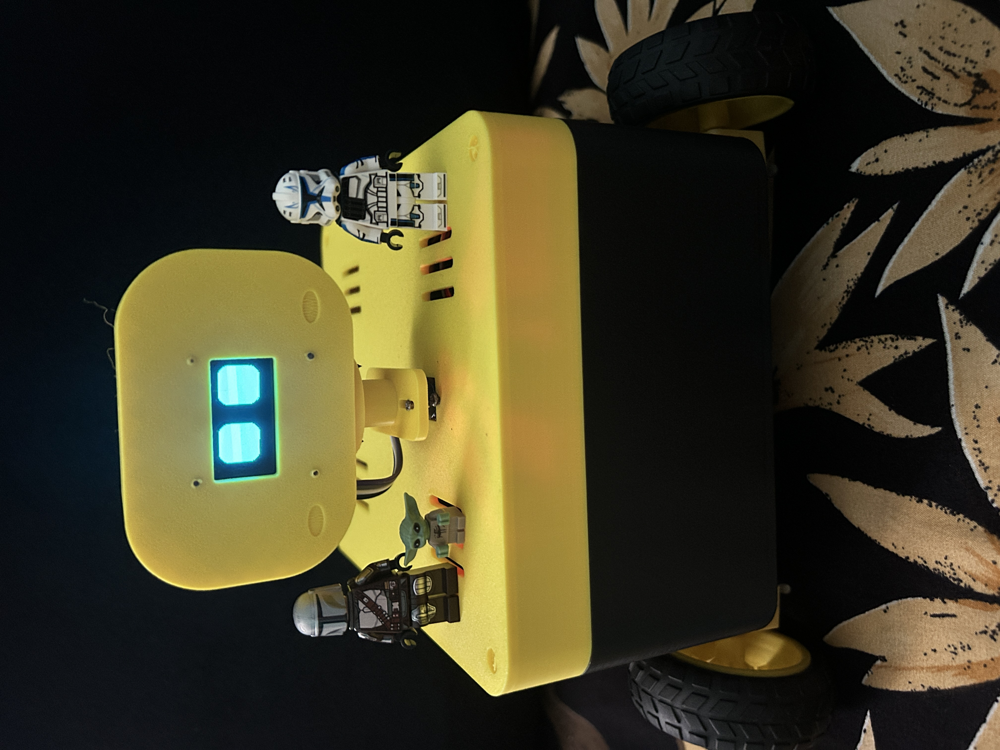
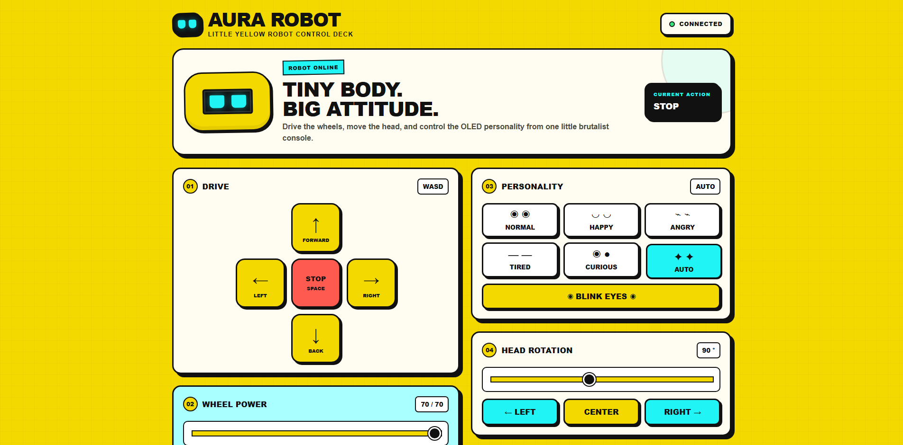
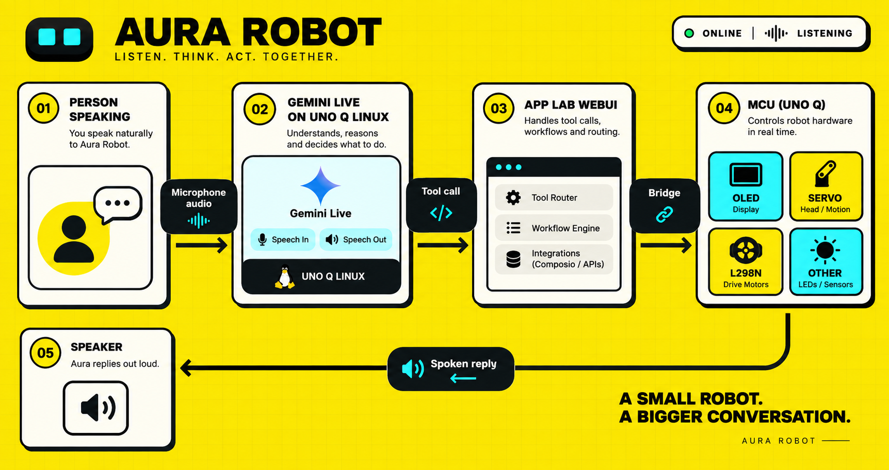
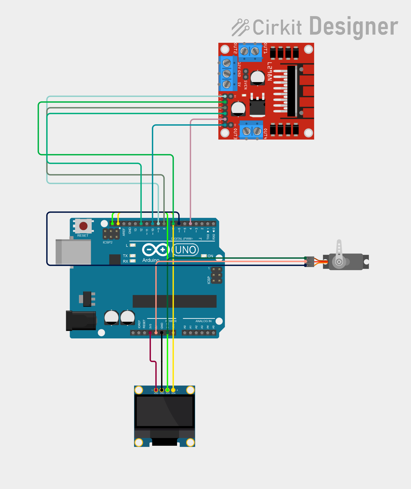

# Aura — AI Social Assistance Robot

> A warm, voice-first companion robot that turns everyday conversation into a tangible, expressive interaction.


Aura is an AI-powered social-assistance robot built with Arduino UNO Q and Arduino App Lab. It combines Gemini Live voice conversation with a physical personality: animated OLED eyes, a head that looks toward the user, expressive reactions, and safe, bounded movement. Rather than presenting another screen-based assistant, Aura makes AI feel present, approachable, and easier to engage with.

This project is designed for the **Social Assistance Robot** scenario in the [Invent the Future with Arduino UNO Q and App Lab contest](https://www.hackster.io/contests/invent-the-future-with-arduino-uno-q-and-app-lab). It demonstrates how the UNO Q can connect Linux-class AI and real-time embedded control in one friendly device.

## Introduction

Voice assistants are useful, but they can feel invisible, transactional, and difficult to connect with—especially for people who benefit from gentle social cues, simple interfaces, or encouragement to start a conversation. Aura explores a more human-centered alternative: a small companion that listens, speaks naturally, and visibly reacts.

When someone says hello, Aura greets them with a happy face and a small head gesture. When it is praised, curious, celebrating, or saying goodnight, its expression changes to match the moment. A user can ask a question, share an idea, or give a direct movement command without learning an app or menu. The result is a playful proof of concept for future social companions in homes, classrooms, maker spaces, and wellbeing-oriented experiences.

Aura is intentionally a **voice-first prototype**, not an autonomous navigation robot. It has no obstacle, bumper, cliff, camera, or identity sensors today. Its motion behavior is therefore conservative and always requires an explicit user command.

For a short submission-ready version, see [INTRODUCTION.md](INTRODUCTION.md).

## Project evidence and recreation guide

Aura is documented so a beginner can understand both what was built and how to rebuild it:

| Evidence | What it demonstrates |
| --- | --- |
|  | The finished wheeled companion with its expressive OLED head. |
|  | The dashboard used to check motors, head, eyes, and connection state. |
|  | How Gemini Live, the UNO Q Linux side, App Lab, and the MCU cooperate. |
| [Circuit diagram](circuit_image.png) | The physical controller, motor driver, servo, and OLED wiring reference. |

Follow [BUILD_GUIDE.md](BUILD_GUIDE.md) as a linear beginner build. It explains the complete bill of materials, each used UNO Q connection, USB-C audio, safe power wiring, assembly, deployment, and verification.

## Why Arduino UNO Q and App Lab

Aura uses the UNO Q's dual-compute design in a way that is difficult to achieve with a conventional microcontroller alone:

| UNO Q capability | Aura implementation |
| --- | --- |
| Linux-side processing | Python streams microphone audio to Gemini Live, plays audio responses, manages voice turns, and interprets tool calls. |
| Real-time MCU control | The Arduino sketch drives the L298N, head servo, OLED animation, blink state, and timed motor stop. |
| Arduino Bridge | The App Lab Python service sends safe commands from Linux to the MCU. |
| App Lab WebUI | A browser dashboard provides transparent manual control, status, and a fallback interface during testing. |


## Innovation and real-world value

### Social impact

Aura makes conversational AI more approachable through visible non-verbal feedback: eye expressions, blinks, head gestures, and a warm speaking style. This can support low-pressure conversation practice, companionship activities, classroom engagement, and inclusive maker demonstrations. It does not claim to replace carers, therapists, teachers, or professional support; it is a platform for exploring more empathetic human-machine interaction.

### User experience

The primary interface is natural speech. Aura keeps spoken responses short, avoids exposing function names or technical details, and provides a familiar browser control deck for setup and manual testing. A user can say `Hello Aura`, `look right`, `move forward`, or `stop` instead of learning a command syntax.

### Technical innovation

The project separates language-model intent from low-level hardware control. Gemini receives only semantic actions such as `move_briefly`, `look`, `express`, and `stop_robot`; it never receives unrestricted PWM or raw pin access. The MCU enforces movement timing independently, which means ordinary 2.5-second motions stop even if the voice process disconnects.

### Scalability and future potential

Aura's semantic action layer makes it possible to add features without redesigning the conversational system. Future versions can add a camera for opt-in visual interaction, distance and cliff sensors for safer assisted navigation, local wake-word processing, personalized routines, multilingual modes, and privacy-preserving on-device models. The same interaction design can also scale from a desk companion to classroom or community installations.

### Sustainability and responsible design

Aura is modular: the mechanical shell, L298N, servo, display, App Lab application, and voice app can be repaired or upgraded independently. Its current low-speed, short-duration motion policy reduces unnecessary motor runtime. Audio is sent to Gemini Live for conversation, so deployments should clearly inform users about network use and handle API keys as secrets.

## Current capabilities

- Short, natural Gemini Live conversations with a warm companion personality.
- Automatic happy greeting gesture for `hello`, `hi`, and similar greetings.
- Normal movement at speed 70 for 2.5 seconds, followed by an MCU-enforced stop.
- Explicit continuous motion that stops when the user says `stop` or the voice app cannot renew its timed pulses.
- Head movement from 55° left to 135° right, eye blinking, temporary moods, and stationary cute gestures.

## Complete bill of materials

Quantities describe the reference build. Equivalent parts are fine when their voltage, current, dimensions, and connector requirements are compatible.

### Hardware

| Qty. | Part | Role / selection notes |
| --- | --- | --- |
| 1 | Arduino UNO Q | Runs Arduino App Lab, the Linux voice application, and the real-time MCU sketch. |
| 1 | L298N dual H-bridge motor-driver module | Drives the left and right DC motors. Its ENA and ENB pins must be available for PWM speed control. |
| 4 | DC BO and wheels | Left and right drive. Match them to the printed chassis and selected motor supply. |
| 1 | Compatible positional servo and two-arm horn | Turns Aura's head. The printed adapter expects a two-arm horn. |
| 1 | 128 × 64 SH1106 I²C OLED module | Animated face display. Use a module compatible with its selected logic voltage. |
| 1 set | Five supplied 3D-printed parts | Chassis, body, OLED head front, head rear cover, and horn adapter. |
| 1 | Regulated motor/servo power supply | Size it for the motors' stall current and the servo's peak current. Keep it separate from UNO Q USB logic power. |
| 1 | USB microphone | Voice input; connects through the UNO Q USB-C host path. |
| 1 | Powered AUX speaker or amplified speaker | Aura's voice output; connects through a USB-C audio adapter/hub. A passive speaker alone is not sufficient. |
| 1 | USB-C audio adapter or powered USB-C hub, plus data cables/adapters | Lets the UNO Q enumerate the microphone and speaker. Choose a data-capable, Linux-compatible device. |
| As needed | Jumper wires, motor wire, cable ties, M3 screws/nuts, and mounting hardware | Electrical connections, strain relief, and enclosure assembly. |

### Software and tools

| Item | Why it is needed |
| --- | --- |
| Arduino App Lab | Deploys the UNO Q MCU sketch, Linux Bridge service, and browser dashboard. |
| Python with the packages in [`robot/requirements.txt`](robot/requirements.txt) | Gemini Live audio streaming and safe semantic robot actions. |
| Gemini API key | Enables Gemini Live conversation. Keep it in `robot/.env`, never in source control. |
| A 3D printer and slicer | Prints the supplied STL enclosure files. |
| Small screwdriver, wire stripper/cutter, and a multimeter | Assembly, polarity checks, and debugging. |
| Web browser and SSH terminal | Dashboard control and starting the voice application. |

## Project layout

```text
Aura Robot/
├── Arduino Uno Q App/
│   ├── sketch/sketch.ino       # MCU: motors, servo, OLED, timed stop
│   ├── python/main.py          # Linux-side Bridge and WebUI API
│   └── assets/index.html       # Manual browser controller
├── 3D Assets/                   # Printable chassis, head, and servo parts
├── circuit_image.png            # Reference wiring diagram
├── assets/                      # Project photos, dashboard, architecture
├── BUILD_GUIDE.md                # Step-by-step beginner build and pin guide
├── robot/
│   ├── robot.py                # Gemini Live voice application
│   ├── robot_tools.py          # Safe HTTP robot actions
│   ├── requirements.txt        # Tested Python dependency versions
│   ├── .env.example            # Configuration template
│   └── README.md               # Voice app reference
└── README.md                   # This guide
```

## Mechanical build and electronics



The provided diagram is the reference for the physical build; the pin definitions in [`sketch.ino`](<Arduino Uno Q App/sketch/sketch.ino>) are the software source of truth. The full beginner sequence, including USB-C audio setup, is in [BUILD_GUIDE.md](BUILD_GUIDE.md). Build and test the robot before starting the voice application.

### 3D-printed parts

| Printable asset | Purpose |
| --- | --- |
| [`01_lower_chassis_8_round_holes.stl`](<3D Assets/01_lower_chassis_8_round_holes.stl>) | Lower wheeled chassis and mounting base. |
| [`02_body_cover_centred_servo.stl`](<3D Assets/02_body_cover_centred_servo.stl>) | Main body cover with a centered head-servo mount. |
| [`03_oled_head_front_M3.stl`](<3D Assets/03_oled_head_front_M3.stl>) | OLED face/head front; designed for M3 mounting hardware. |
| [`04_head_rear_cover.stl`](<3D Assets/04_head_rear_cover.stl>) | Rear cover that closes and protects the head assembly. |
| [`05_two_arm_horn_adapter.stl`](<3D Assets/05_two_arm_horn_adapter.stl>) | Adapter between the head and a two-arm servo horn. |

No print profile is included, so choose material, layer height, infill, and supports for your printer. Print a single fit-test part first if your printer tends to vary in hole size.

Suggested assembly order:

1. Print the five STL files and prepare the motors, wheels, servo, OLED, UNO Q, L298N, and suitable fasteners.
2. Secure the servo in the centered mount of the body cover. Before fitting the horn adapter, power the servo and center it with `/api/servo/90`.
3. Fit the two-arm horn adapter to the centered servo, then attach the head assembly. This avoids a crooked or mechanically blocked head range.
4. Install the OLED in the head front, using M3 hardware where the part requires it, then close the head with the rear cover.
5. Mount the electronics and cable runs on the lower chassis. Keep motor wires clear of the wheels and leave enough slack for the head to turn from 55° to 135°.

### Wiring map

Disconnect all power before wiring. Use the diagram above for placement and route the controller signals as follows:

| UNO Q connection | Connect to | Function and check |
| --- | --- | --- |
| D9 (PWM) | L298N ENA | Left-motor speed enable. Remove the ENA jumper on modules that fit one, otherwise PWM speed control is bypassed. |
| D7 | L298N IN1 | Left-motor direction input 1. |
| D8 | L298N IN2 | Left-motor direction input 2. |
| D10 (PWM) | L298N ENB | Right-motor speed enable. Remove the ENB jumper on modules that fit one. |
| D12 | L298N IN3 | Right-motor direction input 1. |
| D13 | L298N IN4 | Right-motor direction input 2. |
| D6 | Servo signal | Head control; the application restricts the physical target to 55°–135°. |
| SDA / SCL pins marked on the UNO Q | SH1106 OLED SDA / SCL | Hardware I²C data and clock. Do not substitute arbitrary digital pins. |
| GND | L298N GND, servo GND, OLED GND, supply negative | One common reference is required for all control signals. |
| Regulated logic supply | OLED VCC and servo V+ as required by their specifications | Check each module's voltage label before connection. |
| Regulated motor supply | L298N motor-power input | Size for motor stall current; follow the regulator/jumper notes printed on the specific L298N board. |

Connect the left motor to L298N `OUT1`/`OUT2` and the right motor to `OUT3`/`OUT4`. If a motor's direction is reversed after a wheels-raised test, set `LEFT_REVERSED` or `RIGHT_REVERSED` in the sketch rather than changing the voice behavior.

### USB-C microphone and AUX speaker

Audio does **not** use UNO Q GPIO pins. The reference build uses a normal USB microphone and a powered 3.5 mm AUX speaker through the UNO Q USB-C host/audio path:

1. Connect a data-capable USB-C audio adapter or powered USB-C hub to the UNO Q.
2. Connect the USB microphone to that host path.
3. Connect the AUX speaker to the adapter's 3.5 mm audio output. Use an active/powered speaker or an external amplifier; a raw passive speaker cannot be driven directly.
4. Use a data-capable USB-C cable, not a charging-only cable. If microphone and speaker are separate USB devices, use a powered hub that exposes both to Linux.
5. On the UNO Q, list the detected devices with `python3 -c "import sounddevice as sd; print(sd.query_devices())"`, then put identifying names in `INPUT_DEVICE` and `OUTPUT_DEVICE` in `robot/.env`.

The voice process mutes its microphone stream while Aura speaks and waits briefly before resuming it, reducing speaker echo. Keep `ALLOW_BARGE_IN=false` unless you add acoustic echo cancellation or headphones.

The diagram does not specify one universal battery or supply: choose one rated for your specific motors and servo, including their startup/stall current. Do **not** power the motors or servo from the UNO Q USB/logic 5 V rail. Disconnect power while changing wiring, first test with the wheels raised, and verify `/api/stop` before placing Aura on the floor.

## Code, contribution, and creativity

| Contribution | Where it lives | Why it matters |
| --- | --- | --- |
| Real-time robot control | [`sketch.ino`](<Arduino Uno Q App/sketch/sketch.ino>) | Commented MCU code animates the OLED, drives the servo and L298N, and enforces a timed motor stop independently of the network. |
| App Lab Bridge and dashboard API | [`Arduino Uno Q App/python/main.py`](<Arduino Uno Q App/python/main.py>) | Connects the Linux and MCU sides and enables transparent manual tests. |
| Gemini Live conversation | [`robot/robot.py`](robot/robot.py) | Captures USB microphone audio, handles turn taking/reconnection, plays Aura's voice, and keeps its personality concise and warm. |
| Safe action boundary | [`robot/robot_tools.py`](robot/robot_tools.py) | Gives Gemini semantic actions rather than raw pins or PWM: short move, continuous move, stop, look, emotion, blink, and cute gestures. |

Aura's creative contribution is that voice conversation has an embodied, readable response: animated eyes, head motion, and a gentle physical personality make the assistant feel present without handing unsafe low-level control to the model. UNO Q's Linux side handles conversational AI while its MCU independently maintains predictable motion limits. This fresh combination makes the robot approachable for homes, classrooms, maker spaces, and social-assistance demonstrations.


## Setup

### 1. Deploy the App Lab project

Open `Arduino Uno Q App` in Arduino App Lab and click **Run**. This flashes the MCU sketch, deploys the Linux-side app, and starts the WebUI service.

Open the manual dashboard and make sure it reports **Connected**. With wheels raised, test stop, servo left/center/right, blink, and wheel directions. See [Arduino UNO Q App guide](<Arduino Uno Q App/README.md>) for its API and deployment details.

### 2. Configure the voice app

Copy the whole `robot` directory to the UNO Q. Keep `robot.py` and `robot_tools.py` from the same version.

```bash
cd robot
python3 -m venv venv
source venv/bin/activate
python -m pip install -r requirements.txt
cp .env.example .env
```

Set `GEMINI_API_KEY`, audio-device names, and the App Lab WebUI base URL in `.env`. This project defaults to `http://127.0.0.1:7000`; use the exact URL/port shown by App Lab if yours differs, and do not add `/api` to it.

Verify the connection:

```bash
curl http://127.0.0.1:PORT/api/status
```

Replace `PORT` with the App Lab WebUI port in your `.env`.

The result should include `"success": true`, safe speed `70`, and servo limits `55` and `135`.

### 3. Start Aura

```bash
cd robot
source venv/bin/activate
python3 -B robot.py
```

`-B` avoids stale bytecode during SSH iteration. Wait for **Aura is ready**, then say `Hello Aura`.

## Voice commands

| Say | Result |
| --- | --- |
| `Hello Aura` | Head-and-eye greeting, then Aura responds. |
| `Move forward` | Forward at speed 70 for 2.5 seconds. |
| `Turn left` | Spins left at speed 70 for 2.5 seconds. |
| `Move continuously forward` | Moves until told to stop; stay nearby. |
| `Stop` | Immediately stops wheel motion. |
| `Look left` / `look right` | Moves head to 55° / 135°. |
| `Blink` | Blinks the OLED eyes. |
| `Be happy` | Shows a temporary happy expression. |
| `Celebrate with me` | Performs a stationary happy gesture. |

Aura will not move for a hypothetical or unclear request. Use a direct command.

## Update order

1. Click **Run** in Arduino App Lab after changing `sketch.ino` or `main.py`.
2. Copy both `robot/robot.py` and `robot/robot_tools.py` together after changing either one.
3. Restart with `python3 -B robot.py`.
4. Test wheels raised before testing on the floor.

If you see `RobotController has no attribute move_briefly`, the two voice-app files are different versions. Sync both files and restart in the `robot` directory.

## Troubleshooting

| Symptom | Check |
| --- | --- |
| `GEMINI_API_KEY missing` | Add a valid key to `robot/.env`. |
| Audio device not found | List devices with `python3 -c "import sounddevice as sd; print(sd.query_devices())"`, then update `.env`. |
| No `You:` after Aura is ready | Check microphone selection and lower `MIC_VOICE_RMS_THRESHOLD` in `.env` from `1200` to `800`, then restart. |
| `You:` appears but there is no reply | The 12-second voice watchdog now closes and reconnects a stale Live session. Update all voice files and dependencies if that recovery message does not appear. |
| Opening handshake times out | Keep the process running: it now retries with exponential backoff. Check internet/DNS and the API key if every attempt fails. |
| `another Aura voice process is already running` | Stop the older `robot.py` process first. Two processes cannot safely share the USB microphone and speaker. |
| `[Aura] Robot action failed` | Test `curl http://127.0.0.1:PORT/api/status` and redeploy App Lab. |
| `[Aura] Greeting gesture unavailable` | Deploy the current App Lab project and sync both voice-app files. |

See [robot/README.md](robot/README.md) for configuration and logs, and the [Arduino UNO Q App guide](<Arduino Uno Q App/README.md>) for the HTTP API.
